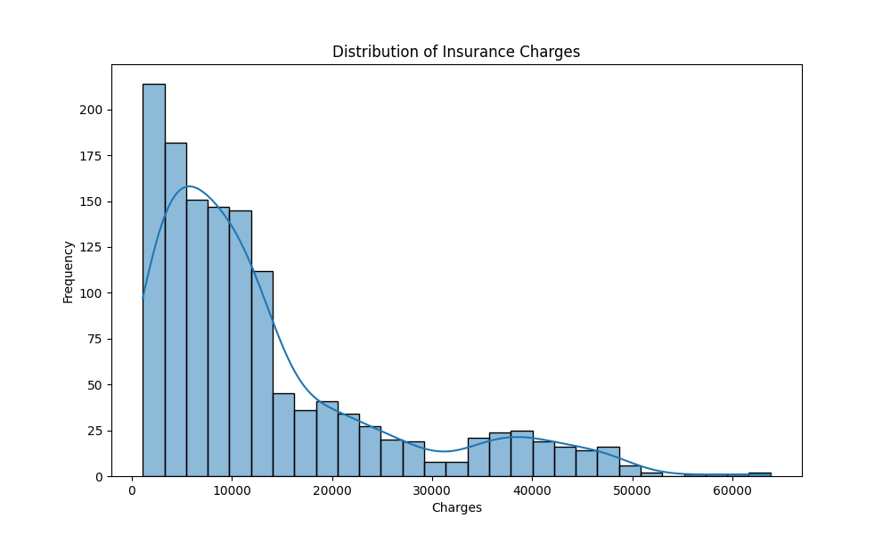

# 👩‍⚕️🚑 Predictive Health Insurance Premium Calculator

A web-based application that intelligently predicts health insurance premiums using machine learning. The calculator provides estimates based on user-inputted data, helping customers get an idea of their potential insurance costs.

 


## ✨ Features
- **Machine Learning Model**: Trained model that predicts premiums based on various factors
- **User-Friendly Interface**: Simple web form for inputting vehicle and driver details
- **Instant Results**: Quick premium calculation after form submission

## 🛠️ Technologies Used
- **Frontend**: HTML, CSS, JavaScript
- **Backend**: Flask
- **Machine Learning**: XGBoost, scikit-learn
- **Data Processing**: Pandas, NumPy

## 📊 Dataset
The machine learning model was trained using the [Healthcare Insurance](https://www.kaggle.com/datasets/willianoliveiragibin/healthcare-insurance) by Willian Oliveira and Arun Jangir.

Dataset includes:
- Age
- Sex
- BMI
- Children
- Smoker
- Region
- Recorded Premium Charges

## 🚀 Getting Started

### Prerequisites
- Python (version 3.x)
- pip install requirements

### Installation
1. Clone the repository:
   ```bash
   git clone https://github.com/alyssadong2006/Health-Insurance-Premium-Calculator